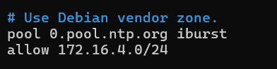
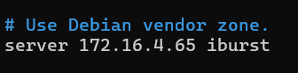

# Procédure d'installation
## Installation VM de Log

```bash
apt install sudo apt install rsyslog -y
```
* crée un fichier pour le client example client.conf 
  se rendre dans les fichier /etc/rsyslog.d/client.conf autorisé les flux sur le port 514 (port de base pour rsyslog) vers la machine contenant la BDD.


* coté serveur :

```bash
apt install sudo apt install rsyslog -y
```
* crée un fichier server.conf, autorisé les flux tcp sur le port 514.


* redemarrer le service.

```bash
systemctl restart rsyslog
```

## Installation chrony pour la syncronisation ntp :

```bash
sudo apt install chrony -y
```
* crée un fichier dans /etc/chrony/chrony.conf dans la vm ou il y a la bdd

```bash
pool 0.pool.ntp.org iburst
allow 172.16.4.0/24 
```


* dans la vm log faire pareil crée un fichier dans /etc/chrony/chrony.conf

```bash
server 172.16.4.65 iburst 
```


ne pas oublier de redemarrer chrony
systemctl restart chrony